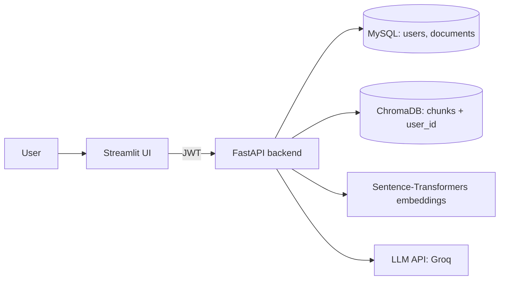

# RAG Document Q&A

A multi-user web app where people create an account, upload their own PDFs, and ask questions about them. Answers are generated by an LLM **only from the user's own documents**, with page-level citations. The app refuses questions the documents can't answer.

Built end to end: PDF ingestion, vector search, grounded generation, authentication, a SQL database, and a measured retrieval evaluation.

## Features

- **Accounts:** sign up, log in, log out (bcrypt password hashing, JWT sessions)
- **Per-user isolation:** every vector chunk is tagged with its owner, and every search is filtered by user, so one user's questions can never reach another user's PDFs
- **Grounded answers with citations:** each claim cites `(file, page N)`; only pages the answer actually cites are shown as sources
- **Refuses out-of-scope questions:** a relevance-score cutoff blocks irrelevant queries before they reach the LLM, and the prompt tells the LLM to say "I don't have enough information" when the context doesn't answer
- **Document management:** upload, list, and delete PDFs per account
- **Evaluation harness:** a 22-question set and a script that report retrieval hit rate and refusal accuracy for any configuration

## Architecture



**Upload flow:** PDF → extract text per page → clean → sentence-aware chunks (about 800 characters, 1-sentence overlap, tiny chunks dropped) → embed with `all-MiniLM-L6-v2` → store in ChromaDB with `user_id`, source file, and page → record the document in MySQL.

**Question flow:** embed the question → search ChromaDB filtered to the user's chunks (top 4) → drop chunks below a 0.45 similarity cutoff → if nothing remains, refuse → otherwise send the chunks plus the question to the LLM with strict "answer only from context, cite sources" rules → return the answer and cited pages.

## Tech stack

| Layer | Tools |
|---|---|
| Backend | Python 3.11, FastAPI, Uvicorn |
| Frontend | Streamlit |
| Database | MySQL (SQLAlchemy + PyMySQL) |
| Vector store | ChromaDB (persistent) |
| Embeddings | Sentence-Transformers (`all-MiniLM-L6-v2`, runs on CPU) |
| LLM | Any OpenAI-compatible API; developed against Groq |
| Auth | bcrypt, JWT (PyJWT) |
| PDF parsing | pypdf |

## Evaluation

I built a 22-question evaluation set (18 answerable questions with the expected source pages, 4 out-of-scope questions) over a machine learning textbook, and used it to make each design decision with numbers instead of guesses.

| Configuration | Retrieval hit rate | Wrongly refused | Out-of-scope refused |
|---|---|---|---|
| `all-MiniLM-L6-v2`, top-4, cutoff 0.45 (**used**) | 16/18 (89%) | 0/18 | 4/4 |
| `bge-small-en-v1.5`, top-4, best cutoff 0.70 | 17/18 (94%) | 0/18 | 3/4 |

*Hit rate means at least one expected page was among the retrieved chunks.*

What the experiments showed:

- **Sentence-aware chunking and text cleaning** fixed chunks that started mid-word and tiny junk chunks that matched random queries.
- **A relevance cutoff** was chosen from measured score distributions, not guessed. A cutoff alone can't perfectly separate in-scope from out-of-scope questions, so the prompt's "say you don't know" rule acts as a second line of defense.
- **A stronger embedding model did not win.** BGE compressed all scores into a narrow high band, so in-scope and out-of-scope questions overlapped and no single cutoff separated them. I kept the simpler model.
- **Weak spot:** paraphrased questions that avoid the document's wording (for example "memorizing the training data" versus "overfitting") can miss the best chunk.

**Caveats:** this is a small, hand-written set, and the settings were tuned on the same questions, so treat the numbers as indicative, not as general accuracy. The set targets a copyrighted textbook that is not included in this repo. To evaluate on your own documents, edit `eval/eval_questions.json` and run:

```bash
python eval/run_eval.py 4 0.45     # top-k, cutoff
python eval/run_eval.py sweep      # compare several top-k values
```

## Security

- Passwords are hashed with bcrypt; plain-text passwords are never stored
- JWT access tokens expire after 60 minutes
- Login returns the same error for a wrong email and a wrong password
- Requests for another user's document ID return 404, so IDs aren't revealed
- The app connects to MySQL with a dedicated limited-privilege user, not root
- Secrets live in environment variables (`.env`, which is git-ignored)
- Uploads are limited to 20 MB, PDF only, and file names are sanitized

## API

| Method | Endpoint | Auth | Purpose |
|---|---|---|---|
| POST | `/auth/signup` | no | Create an account |
| POST | `/auth/login` | no | Get an access token |
| GET | `/auth/me` | yes | Current user |
| POST | `/upload` | yes | Upload and index a PDF |
| GET | `/documents` | yes | List your documents |
| DELETE | `/documents/{id}` | yes | Delete a document and its vectors |
| POST | `/ask` | yes | Ask a question about your documents |
| GET | `/health` | no | Health check |

Interactive docs are served at `/docs` when the backend is running.

## Project structure

```
.
├── app/
│   ├── main.py        # FastAPI app and endpoints
│   ├── auth.py        # signup / login routes
│   ├── deps.py        # current-user dependency
│   ├── security.py    # password hashing, JWT
│   ├── models.py      # SQLAlchemy models (User, Document)
│   ├── db.py          # database engine and session
│   ├── store.py       # embedding model and ChromaDB client
│   ├── ingest.py      # PDF -> chunks -> embeddings
│   ├── retrieve.py    # per-user vector search with score cutoff
│   ├── generate.py    # grounded LLM answer with citations
│   └── config.py      # settings from environment
├── frontend/
│   └── streamlit_app.py
├── eval/
│   ├── eval_questions.json
│   └── run_eval.py
├── .env.example
└── requirements.txt
```

## Setup

**Prerequisites:** Python 3.11, MySQL 8, and an API key for an OpenAI-compatible LLM provider (for example Groq).

**1. Clone and install**

```bash
git clone https://github.com/<your-username>/rag-document-qa.git
cd rag-document-qa
python -m venv .venv
# Windows: .venv\Scripts\activate    macOS/Linux: source .venv/bin/activate
pip install -r requirements.txt
```

**2. Create the database**

```sql
CREATE DATABASE rag_app CHARACTER SET utf8mb4 COLLATE utf8mb4_unicode_ci;
CREATE USER 'rag_user'@'localhost' IDENTIFIED BY 'choose-a-password';
GRANT ALL PRIVILEGES ON rag_app.* TO 'rag_user'@'localhost';
FLUSH PRIVILEGES;
```

**3. Configure**

Copy `.env.example` to `.env` and fill in your values. Generate a signing key with:

```bash
python -c "import secrets; print(secrets.token_hex(32))"
```

Model names change over time, so check your LLM provider's current model list when setting `LLM_MODEL`. Because the provider and model are set through environment variables, switching either needs no code changes.

**4. Run**

```bash
uvicorn app.main:app --reload                      # terminal 1: backend
streamlit run frontend/streamlit_app.py            # terminal 2: frontend
```

Open `http://localhost:8501`, create an account, upload a PDF, and start asking questions. The first run downloads the embedding model (about 90 MB). Tables are created automatically on first start.

## Known limitations

| Limitation | Planned fix |
|---|---|
| Logout deletes the token on the client only; a copied token stays valid until it expires | Token revocation list or short-lived tokens with refresh |
| Refreshing the browser logs you out (token kept in Streamlit session state) | Cookie-based session storage |
| No rate limiting on login | Rate limiting or account lockout |
| Must be served over HTTPS in production | Reverse proxy with TLS |
| Scanned (image-only) PDFs are not supported | OCR step |
| Paraphrased queries can miss relevant chunks | Query rewriting, hybrid keyword and semantic search, or a reranker |
| Searches all of a user's documents together | Per-document filtering |
| Vectors (ChromaDB) and records (MySQL) are separate stores and must be reset together | Single-store design or a sync check |

## Roadmap

- [ ] Docker and `docker compose` (backend, frontend, MySQL)
- [ ] Deployment with HTTPS
- [ ] Automated tests for authentication and user isolation (pytest)
- [ ] Retrieval improvements: reranking or hybrid search
- [ ] Per-document question scope